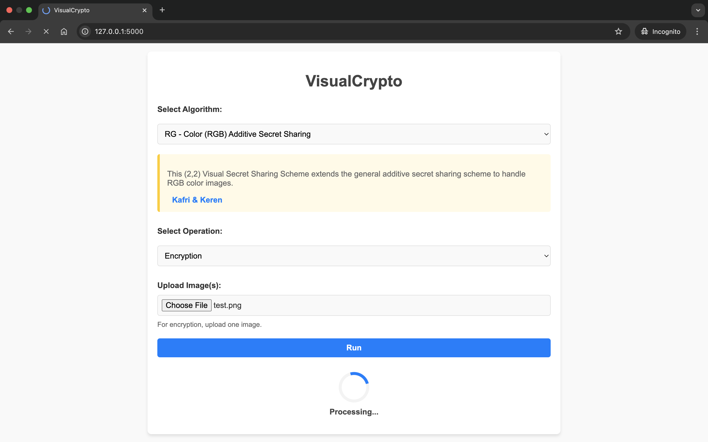
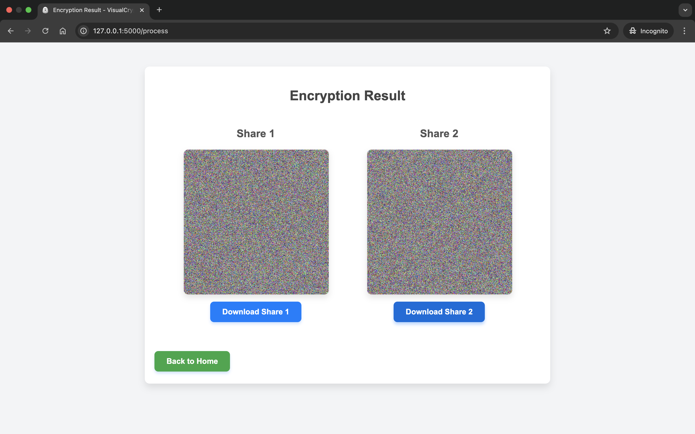
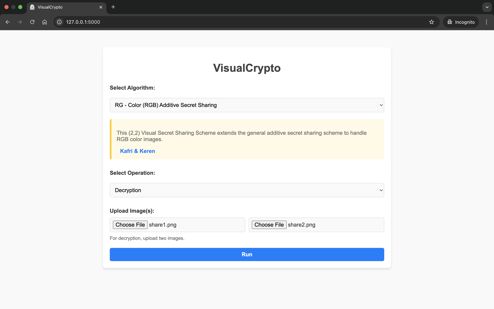

<p align="center">
  <a href="https://github.com/coduri/VisualCrypto">
    
  </a>
</p>

<h1 align="center">VisualCrypto</h1>

<p align="center">A framework for image-based secret sharing</p>

<div align="center">

[](https://www.python.org/downloads/)
[](https://docs.python.org/3/library/secrets.html)
[](https://coduri.github.io/VisualCrypto/)
[](https://coduri.github.io/VisualCrypto/pages/contributing/)
[](https://github.com/coduri/VisualCrypto/blob/main/LICENSE.txt)


</div>


## Overview
**VisualCrypto** is a Python-based framework for **Visual Secret Sharing (VSS)**, a cryptographic technique that divides a secret image into multiple shares. Each share appears as random noise and reveals no information on its own, but when combined, they reconstruct the original image.

This repository primarily focuses on **(2,2)-VSS schemes**, where a secret image is split into two shares, both of which are required to reveal the hidden content.


📌 _For more details on **VisualCrypto**, visit the [Project's Documentation](https://coduri.github.io/VisualCrypto/)._

---

## Features
- Supports Visual Cryptography (VC) & Random Grid (RG) techniques
- Web-based & script-based execution
- Easily extendable for new algorithms

---

## Getting Started

### Installation  
Clone the repository and install dependencies:  
```bash
git clone https://github.com/coduri/VisualCrypto.git
cd VisualCrypto
pip install -r requirements.txt
```

### Usage  
You can interact with the framework in two ways:  
1. **Running Python scripts**
2. **Using the Web Interface**

📌 _For a step-by-step guide, check out the [User Guide](https://coduri.github.io/VisualCrypto/pages/getting_started/)._ 

---

## Web Interface  
Below are sample screenshots of the **web-based interface** of VisualCrypto:

<div align="center">
     
     
</div>

<div align="center">
     
     
</div>

---

## Contributing
Contributions are welcome! 

If you’d like to implement a new Visual Secret Sharing algorithm or improve existing features, please check out our **[Contribution Guide](https://coduri.github.io/VisualCrypto/pages/contributing/)**.  

Before submitting a pull request, ensure that:  
- Your algorithm follows the required structure.  
- You’ve tested both encryption & decryption.  
- The web interface is correctly updated.  

Thank you for helping improve **VisualCrypto**! 🚀  

---

## Main References
- **Visual Cryptography**: Naor, Moni, and Adi Shamir. "Visual cryptography." *Advances in Cryptology—EUROCRYPT'94*. Springer, 1995. <a href="https://doi.org/10.1007/BFb0053419" target="_blank">DOI</a>
- **Random Grid**: Kafri, Oded, and Eliezer Keren. "Encryption of pictures and shapes by random grids." *Optics Letters* 12.6 (1987): 377-379. <a href="https://doi.org/10.1364/ol.12.000377" target="_blank">DOI</a>
  

---

## Citation
If you find this project useful for your research, please consider citing:

 ```bibtex
@misc{Coduri2025VisualCrypto,
    author = {Christian Coduri},
    title = {VisualCrypto: A Python-based framework for image-based secret sharing},
    year = {2025},
    publisher = {GitHub},
    url = {https://github.com/coduri/VisualCrypto},
    note = {GitHub repository}
}
 ```

---

## License
This project is licensed under the **MIT License**. See the [LICENSE](LICENSE.txt) file for details.

---
