# Introduction to Visual Secret Sharing
Visual Secret Sharing (VSS) is a cryptographic technique and a specific application of the general secret sharing method, in which an image or secret is divided into multiple shares. Individually, these shares reveal no information, and the secret can only be reconstructed when a sufficient number of shares are combined.

This repository implements two primary approaches to VSS: **Visual Cryptography (VC)** and **Random Grid (RG)**. Each method has distinct properties, advantages, and limitations, which are outlined in this section.

## Visual Cryptography (VC)
Introduced by <a href="https://doi.org/10.1007/BFb0053419" target="_blank">Naor and Shamir in 1995</a>, this technique enables the human visual system to reconstruct a secret without any computation. By printing the shares on transparent sheets and overlaying them, the secret image is revealed.

  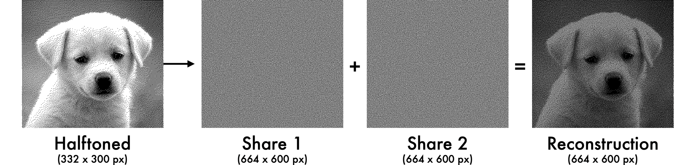

- **Advantages**:
    - Simple, computation-free reconstruction.
    
- **Drawbacks**:
    - Pixel expansion: The reconstructed image and the shares are larger than the original.
    - Decreased quality: The reconstructed image will have higher contrast.
  

??? question "What is an 'Halftoned' image?"  
    **Visual Cryptography operates exclusively on binary images.** While the original input can be grayscale or even color, it must first be converted into a binary format to be compatible with VC schemes. A **binary image** consists of only two colors, typically black and white, though other color pairs can be used.  
    
    This conversion is often achieved through **halftoning**, a technique that simulates continuous tones using only two distinct colors. One widely used halftoning method is **Floyd-Steinberg dithering**, which distributes quantization errors to neighboring pixels, creating a visually smoother representation of grayscale images. By transforming images into a binary format, halftoning ensures that VC can effectively encode and reconstruct secret images.
    
    

      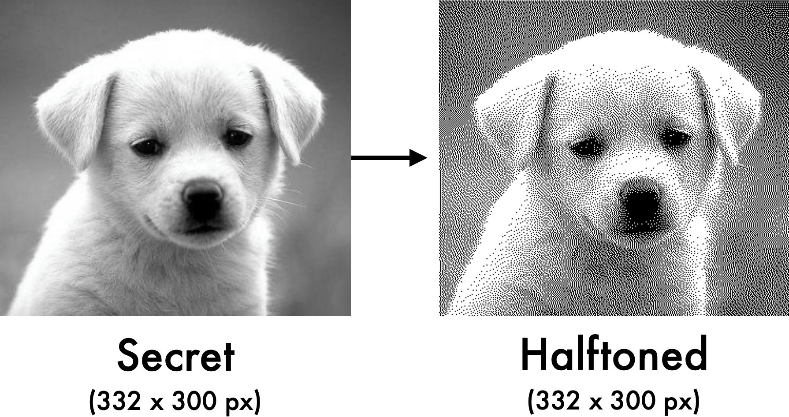
    

??? question "Why Visual Cryptography introduce Pixel Expansion and Higher Contrast?"
    Visual Cryptography relies on pixel expansion to enable a purely visual decryption process. Since VC does not require computational decryption, each pixel of the secret image is expanded into multiple subpixels in the generated shares. This ensures that when the shares are stacked together, a human observer can visually perceive the reconstructed image without additional processing.
  
    In a (2,2)-VC scheme, each pixel of the original image is expanded into four subpixels in each share. This expansion allows the encoding of visual information in a way that maintains perfect secrecy, as the shares appear completely random when viewed independently. However, when the shares are overlaid, the expanded subpixels align in a way that reveals the hidden image.

    

      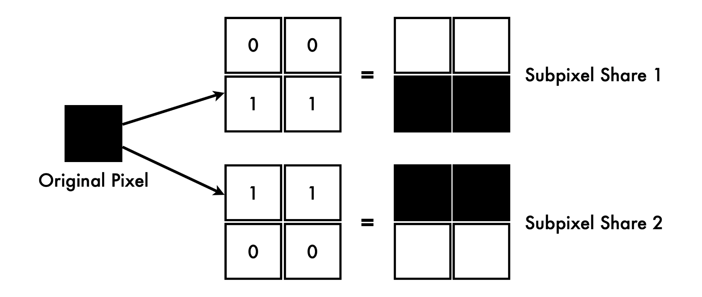
      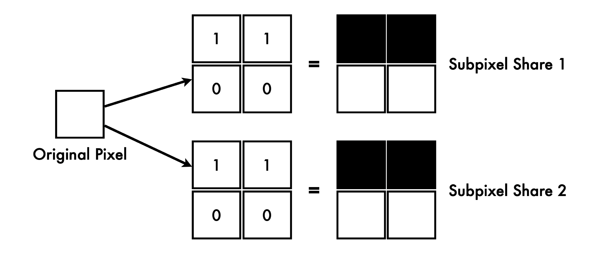
    

    One consequence of this pixel expansion is an increase in contrast. When an original pixel is white, both shares use identical subpixel patterns, resulting in areas that appear partially white when stacked. In contrast, if the original pixel is black, the two shares contain complementary subpixel patterns, making the reconstructed area appear fully black. This difference causes a 50% increase in contrast for white pixels, making the reconstructed image darker and more visually distinct compared to the original.

    The following illustration demonstrates how pixel expansion works and how it impacts the reconstructed image's contrast:

    

      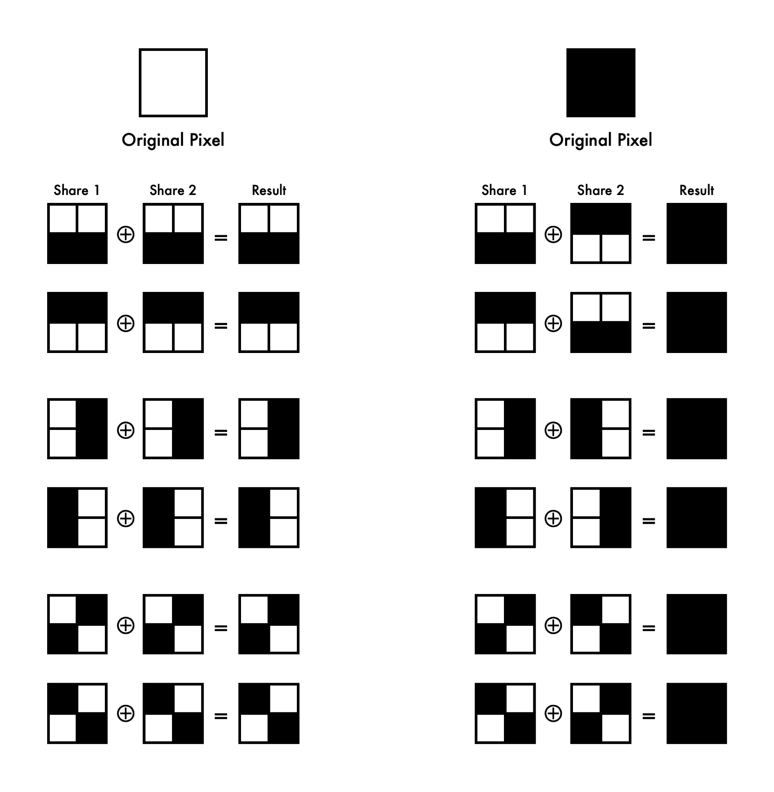
    

    By expanding each pixel and carefully structuring the subpixels, Visual Cryptography ensures that human vision alone can decrypt the secret image while inherently increasing its contrast.

 

## Random Grid (RG)
Proposed by <a href="https://doi.org/10.1364/ol.12.000377" target="_blank" rel="noopener noreferrer">Kafri and Keren in 1987</a>, Random Grid employs computational reconstruction rather than direct visual overlay. This approach mitigates the limitations of pixel expansion and contrast increase found in Visual Cryptography.

  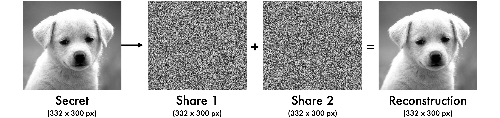

- **Advantages**:
    - Maintains the original image size (no pixel expansion).
    - Preserves image contrast and quality.

- **Drawback**:
    - Requires computational reconstruction.

??? note  
    In the **Random Grid approach**, computation is possible, allowing for the application of **general secret sharing techniques** beyond traditional visual decryption. Unlike Visual Cryptography, which relies solely on the human visual system for decoding, RG-based schemes can leverage mathematical and computational methods to enhance security and improve reconstruction accuracy. This flexibility makes Random Grid a suitable approach for scenarios where digital processing is available and additional cryptographic techniques can be applied.

---

## Comparison of VC and RG Approaches
The table below compares the outputs of **Visual Cryptography** and **Random Grid** using as input the same grayscale halftone images. The scripts used in these examples are `vc_grayscale_halftone.py` and `rg_grayscale_halftone.py`.

<table style="border-collapse: collapse; width: 100%; text-align: center;">
    <colgroup>
        <col style="width: 20%;" />
        <col style="width: 35%;" />
        <col style="width: 35%;" />
    </colgroup>
    <thead>
        <tr>
            <th style="vertical-align: middle; text-align: center;">Step</th>
            <th style="vertical-align: middle; text-align: center;">Visual Cryptography (VC)</th>
            <th style="vertical-align: middle; text-align: center;">Random Grid (RG)</th>
        </tr>
    </thead>
    <tbody>
        <tr>
            <td style="vertical-align: middle; text-align: center;"><strong>Input (Binary Image)</strong></td>
            <td></td>
            <td>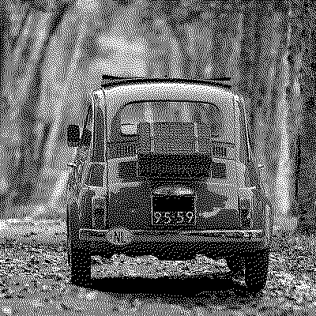</td>
        </tr>
        <tr>
            <td style="vertical-align: middle; text-align: center;"><strong>Share 1</strong></td>
            <td>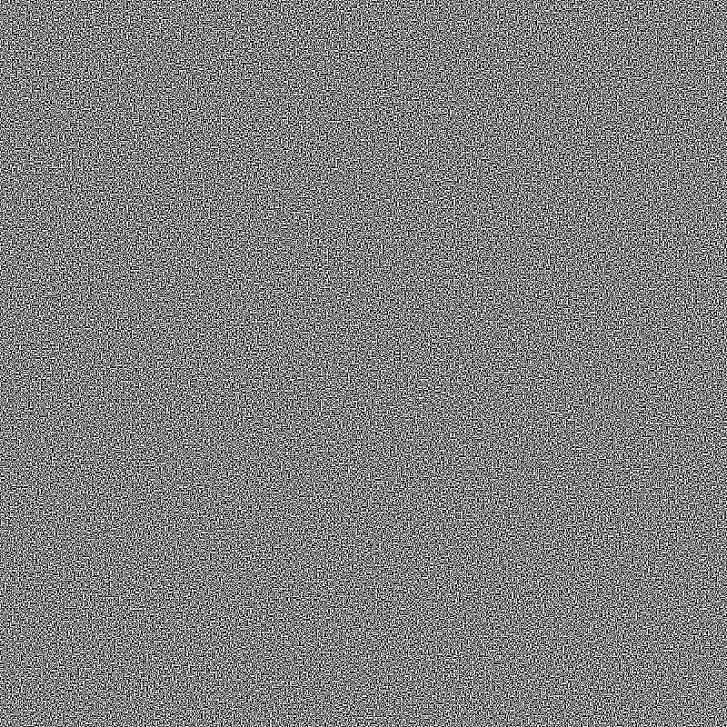</td>
            <td>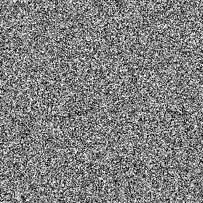</td>
        </tr>
        <tr>
            <td style="vertical-align: middle; text-align: center;"><strong>Share 2</strong></td>
            <td>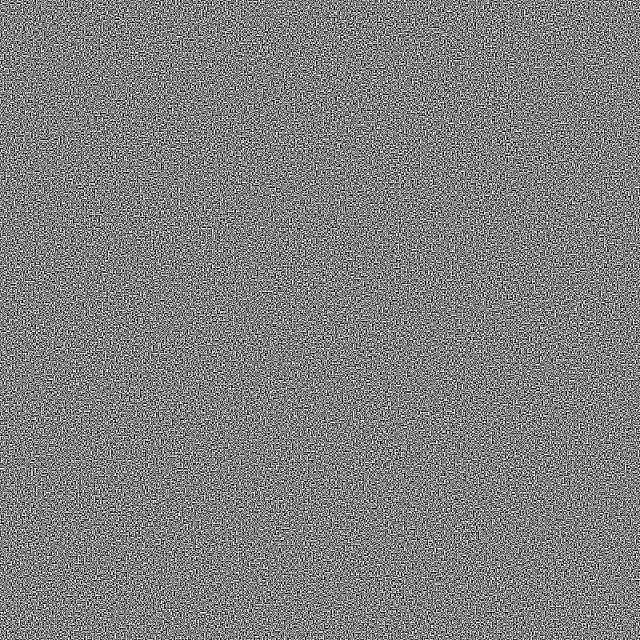</td>
            <td>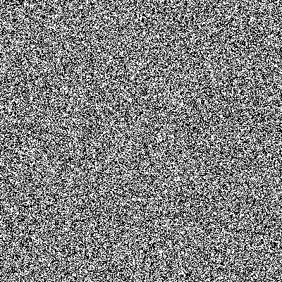</td>
        </tr>
        <tr>
            <td style="vertical-align: middle; text-align: center;"><strong>OR Reconstruction</strong></td>
            <td>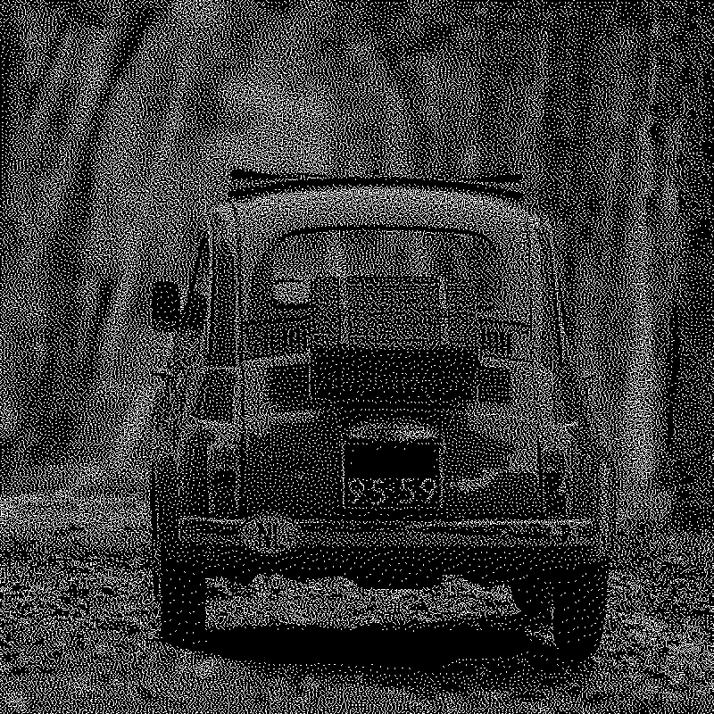</td>
            <td>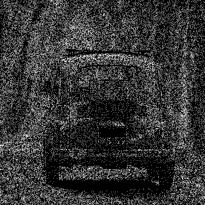</td>
        </tr>
        <tr>
            <td style="vertical-align: middle; text-align: center;"><strong>XOR Reconstruction</strong></td>
            <td style="vertical-align: middle; text-align: center;"><i>Not proposed in the official paper (requires computational processing)</i></td>
            <td></td>
        </tr>
    </tbody>
</table>

For both executions, the input halftone image has a resolution of `400×400 px`.  

- In **Random Grid**, all output images, including the generated shares and the reconstructed image, **mantain the original size** of `400×400 px`.  
- In **Visual Cryptography**, the pixel expansion process results in the shares and reconstructed image **doubling in size** to `800×800 px`.
