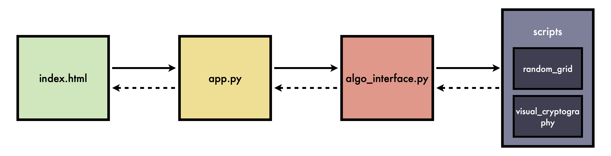

# Welcome to VisualCrypto

## Abstract
**VisualCrypto** is an open-source Python-based toolkit with a web interface designed for **Visual Secret Sharing (VSS)**, a cryptographic technique that splits a secret image into multiple shares. Each share appears as random noise and reveals no information on its own, but when combined, they reconstruct the original image.

This repository primarily focuses on **(2,2)-VSS schemes**, where a secret image is split into two shares, both of which are required to reveal the hidden content.

## Motivation
VisualCrypto was initially developed as part of a bachelor thesis that made use of **Visual Cryptography (VC)** and **Random Grid (RG) schemes**. During the research, several cryptographic schemes were implemented based on official academic papers, primarily to generate images for the thesis. Rather than letting all the code go unused, it was refined and expanded into a publicly available toolkit, making these techniques more accessible to a broader audience.  

One of the key motivations behind VisualCrypto is the lack of a widely recognized and comprehensive library for Visual Secret Sharing schemes. While individual implementations exist, there is no unified software that allows users to easily apply, compare, and experiment with different VSS techniques. By making VisualCrypto open-source, the goal is to provide **researchers, developers, and cryptography enthusiasts** with a well-documented, reliable, and extensible platform for working with various schemes from scientific literature.

## Features
- Support for Visual Cryptography (VC) & Random Grid (RG) techniques
- Web-based & script-based execution for ease of use
- Easily extendable to incorporate new cryptographic schemes
- Reference-based implementation, ensuring that any scientific work derived from this repository maintains appropriate citations.

---

## Design 
Below is an overview of the project's architecture:

<div align="center">
     
</div>

### Key Components
- **`index.html`**: The main frontend interface where users select algorithms, perform operations, and upload images.
- **`app.py`**: A Flask-based web server providing API endpoints for frontend interactions (see [API Reference](pages/api_reference.md) for details).
- **`algo_interface.py`**: An interface to access various visual secret sharing schemes. It maintains a dictionary that maps scheme names to their respective functions.
- **`scripts/`**: Contains the core implementations of visual cryptography and random grid schemes.
      - `visual_cryptography/`: Contains different Visual Cryptography implementations.
      - `random_grid/`: Contains Random Grid based implementations.

### Folder Structure
```
visual-secret-sharing/
├── .github/
├── docs/                           # Documentation files
│
├── scripts/                        # Core scripts for encryption and decryption
│   ├── images/                     # Image assets for testing and output
│   │   ├── output/                 # Stores generated shares and reconstructed images (when using CLI)
│   │   └── test.png                # Example input image used for testing
│   ├── random_grid/                # Scripts for encrypting and decrypting using Random Grid schemes
│   └── visual_cryptography/        # Scripts for encrypting and decrypting using Visual Cryptography schemes
│
├── web_app/                        # Flask-based web application
│   ├── static/                     # Static files used by the web app
│   │   ├── css/                    # Stylesheets for the web interface
│   │   ├── output/                 # Stores generated shares and reconstructed images (when using GUI)
│   │   └── uploads/                # Folder for storing user-uploaded images
│   ├── templates/                  # HTML templates for the web application
│   ├── algo_interface.py           # Interface for accessing VSS schemes and their corresponding functions
│   └── app.py                      # Main Flask application file
│
├── .gitignore
├── LICENSE.txt
├── mkdocs.yml                      # Configuration file for MkDocs, defining the documentation structure
├── README.md
└── requirements.txt                # Python dependencies required to run the project

```

---