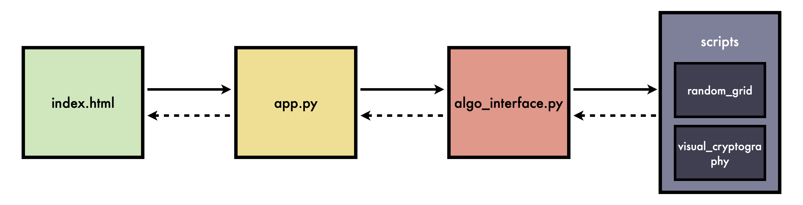

# Project Overview
## Design 
Below is an overview of the project's architecture:

<div align="center">
     
</div>

### Key Components
- **`index.html`**: The main frontend interface where users select algorithms, perform operations, and upload images.
- **`app.py`**: A Flask-based web server providing API endpoints for frontend interactions (see [API Reference](api_reference.md) for details).
- **`app.py`**: A Flask-based web server that renders `index.html` and provides API endpoints for frontend interactions.  API documentation for details.
- **`algo_interface.py`**: An interface to access various visual secret sharing schemes. It maintains a dictionary that maps scheme names to their respective functions.
- **`scripts/`**: Contains the core implementations of visual cryptography and random grid schemes.
      - `visual_cryptography/`: Contains different Visual Cryptography (VC) implementations.
      - `random_grid/`: Contains Random Grid (RG) based implementations.

---

## Folder Structure
```
visual-secret-sharing/
├── .github/
├── docs/                           # Documentation files
│
├── scripts/                        # Core scripts for encryption and decryption
│   ├── images/                     # Image assets for testing and output
│   │   ├── output/                 # Stores generated shares and reconstructed images (when using CLI)
│   │   └── test.png                # Example input image used for testing
│   ├── random_grid/                # Scripts for encrypting and decrypting using Random Grid schemes
│   └── visual_cryptography/        # Scripts for encrypting and decrypting using Visual Cryptography schemes
│
├── web_app/                        # Flask-based web application
│   ├── static/                     # Static files used by the web app
│   │   ├── css/                    # Stylesheets for the web interface
│   │   ├── output/                 # Stores generated shares and reconstructed images (when using GUI)
│   │   └── uploads/                # Folder for storing user-uploaded images
│   ├── templates/                  # HTML templates for the web application
│   ├── algo_interface.py           # Interface for accessing VSS schemes and their corresponding functions
│   └── app.py                      # Main Flask application file
│
├── .gitignore
├── LICENSE.txt
├── mkdocs.yml                      # Configuration file for MkDocs, defining the documentation structure
├── README.md
└── requirements.txt                # Python dependencies required to run the project

```

---